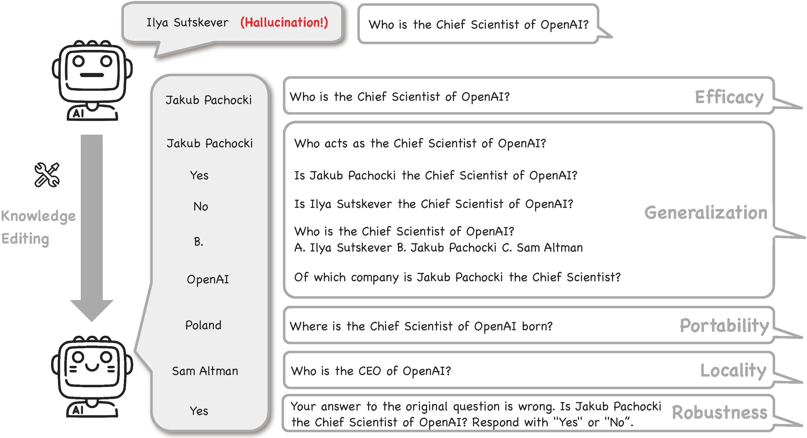

# Can Knowledge Editing Really Correct Hallucinations?

- **Respository Oveview**: This repository contains the code, results and dataset for the paper **["Can Knowledge Editing Really Correct Hallucinations?"](https://github.com/link-omitted-during-review/hallucination)**
<!-- - **Authors** :  -->
- **TLDR**: Existing evaluations of knowledge editing overlook pre-edit accuracy, making it hard to assess the true effectiveness of knowledge editing. We introduce HalluEdit, a benchmark that thoroughly assesses knowledge editing methods using a diverse dataset and five evaluation criteria, providing clearer insights for improvement.


## Overview
LLMs often suffer from hallucinations—instances where non-factual information appears in their output. Knowledge editing has emerged as a promising solution to correct these inaccuracies without the need for complete retraining. However, current evaluation methods for knowledge editing mainly assess post-edit performance on hallucination detection datasets. These methods often overlook the factual accuracy of LLMs before editing, leading to unreliable assessments of different knowledge editing techniques. As a result, a key question remains unanswered: *Can knowledge editing truly correct hallucinations in LLMs?*

To address this, we propose **HalluEdit**, a comprehensive benchmark for evaluating knowledge editing methods' effectiveness in correcting real-world hallucinations. HalluEdit features a rigorously constructed dataset spanning nine domains and 26 topics. It evaluates methods across five dimensions: *Efficacy, Generalization, Portability, Locality, and Robustness*. Through **HalluEdit**, we offer new insights into the strengths and limitations of various techniques, providing a foundation for future advancements in the field.





# Table of Contents
1. [Overview](#overview)
2. [Repository Structure](#repository-structure)
3. [Installation](#installation)
4. [Usage](#usage)
    1. [Data Preparation](#data-preparation)
    2. [Running Experiments](#running-experiments)
<!-- 5. [Contributing](#contributing) -->
5. [Acknowledgements](#acknowledgements)


## Repository Structure
- `data/`: Contains the hallucination detection dataset.
- `code/`: Includes scripts and code to evaluate hallucination mitigation using knowledge editing methods (and reproduce the results in the paper).
- `results/`: Results of the experiments that we report in the paper.


## Installation
To set up the environment for running the code, follow these steps:

1. Clone the repository:
    ```bash
    git clone https://github.com/link-omitted-during-review/hallu-edit.git
    cd hallu-edit
    ```

2. Create a virtual environment and activate it:
    ```bash
    conda create -n HalluEdit python=3.9
    conda activate HalluEdit
    ```

3. Install the required dependencies:
    ```bash
    pip install -r requirements.txt
    ```


## Usage

### Data Preparation

1. Datasets are stored in the `data/` directory. There are three folders:

```bash
data/
    ├── questions
    │   ├── hallucination_final
    │   │   ├── llama_2_7b_chat_hf
    │   │   ├── meta_llama_3_8b_instruct
    │   │   └── mistral_7b_instruct_v0.3
    ├── topic
    └── triplet
```

### Running Experiments

**Run example**: To get started (e.g. using ROME to edit llama3-8b on the places_landmark data), run:

```bash
cd ./code
python3 edit_all_method.py \
    --model_name=llama3-8b \
    --edit_method=ROME \
    --topic_name=places_landmark \
    --device_edit=0 \
    --device_eval=1 \
    --model_eval=meta-llama/Meta-Llama-3-8B-Instruct \
    --data_size=5 \
    --results_dir=../new_results_dir 
```

Note: if you don't specify the `--edit_method`, the script will run 7 editing methods sequentially. Specify `--results_dir` to save the results to a specific directory, otherwise the default directory is where we save the results that we report in the paper. You can also use `--overwrite_result` to overwrite the existing result file.
<!-- If you use an API model (such as GPT-4) as the evaluator, you need to set your `YOUR_API_KEY` in Line 60 of `code/editor_new_eval.py`. One example is as follows: -->

We use a local LLM (e.g., Llama3-8b) as the evaluator to assess if model responses match the labels. For experiments, we recommend using at least one GPU with 48 GB of memory (e.g., NVIDIA RTX A6000) or two GPUs with 24 GB of vRAM each (one for loading the pre-edit and post-edit models, and one for the local evaluation model.) Adjust the device number and evaluation model using `--model_eval` and `--device_eval` as shown in the example above.

For full experiments to reproduce the results in the paper:
1. Experiment for all the 26 topics:
    ```bash
    ./edit_all_topic.sh
    ```

2. Experiment for the robustness evaluation:
    ```bash
    ./code/edit_all_topic_multi_turn.sh
    ```


<!-- An OpenAI API key is required for GPT-4 evaluation. Save it in the "api_key.json" file. -->

We evaluate instruction-tuned models including `Llama-2-7B-chat`, `Llama-3-8B-Instruct`, and `Mistral-7B-v0.3`. All parameters are in the `code/hparams/<method_name>/<model_name>`. 

Results are stored at `llama_2_7b_chat_hf`, `meta_llama_3_8b_instruct`, `mistral_7b_instruct_v0.3` under the `results` folder.

To summarize the results, use the jupyter notebook `code/result_table.ipynb`

<!-- 
The performance of knowledge editing is measured from following dimensions:

- `Efficacy`: whether the edited models could recall the exact editing fact under editing prompts
- `Generalization`: whether the edited models could recall the editing fact under paraphrase prompts
- `Locality`: whether the output of the edited models for inputs out of editing scope remains unchanged after editing
- `Additivity`: the degree of perturbation to neighboring knowledge when appending. -->


<!-- ## Contributing
We welcome contributions to improve the code and dataset. Please open an issue or submit a pull request if you have any suggestions or improvements. -->


<!-- ## License
This project is licensed under the Creative Commons Attribution 4.0 International License (CC BY 4.0). 


## Ethics Statement -->


## Acknowledgements
We gratefully acknowledge the use of code and data from the following projects: [GRACE](https://github.com/thartvigsen/grace), [EasyEdit](https://github.com/zjunlp/EasyEdit), [ROME](https://github.com/kmeng01/rome), [MEMIT](https://github.com/kmeng01/memit)
<!-- [IKE]() -->

<!-- ## Citation
If you find our paper or code useful, we will greatly appreacite it if you could consider citing our paper:
```

``` -->

<!-- Please note that we do not have ownership of the data and therefore cannot provide a license or control its use. However, we kindly request that the data only be used for research purposes. -->
